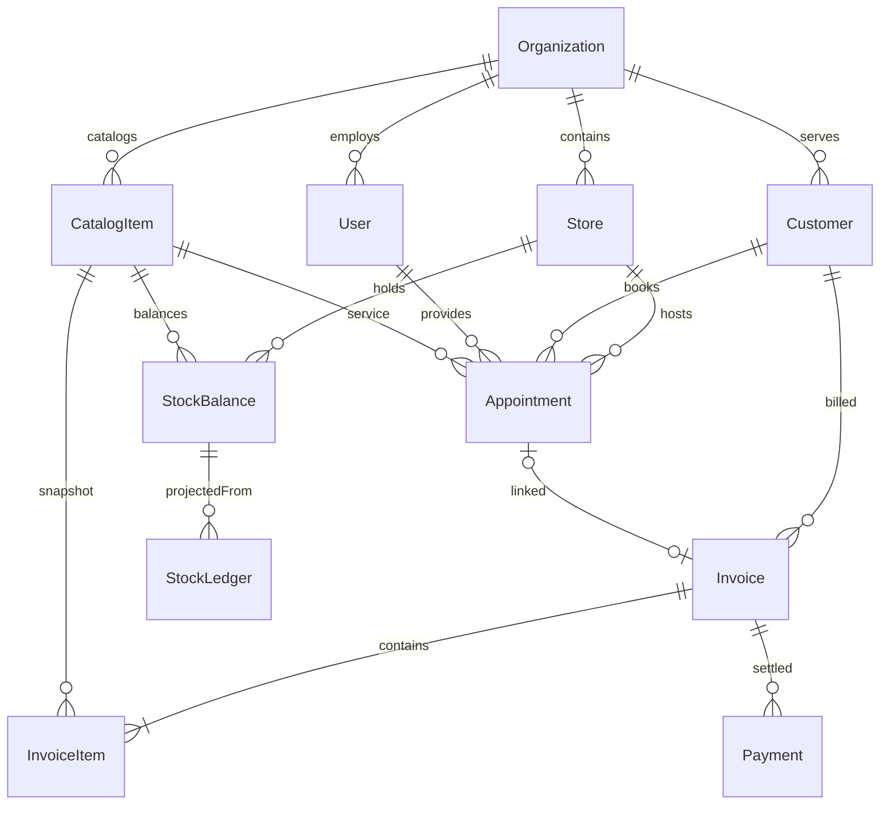

# Phase 1 base model

The model lives in [schema.prisma](../prisma/schema.prisma). Prisma generates a MySQL migration; all public identifiers are UUIDs. Operational records have organization and store scope, and money uses DECIMAL(12,2) with INR currency.

These are logical relationships. Invoice item/payment references have database foreign keys; other references and tenant consistency are checked by application services. Staff store assignments are a JSON list for this increment.

## Commands and invariants

- A store row serializes transactional commands. A therapist row also locks appointment creation across stores.
- Command keys are unique per organization and bind actor, store, operation and payload. Successful response snapshots support safe retry.
- Invoice number sequences, immutable line snapshots, stock debits, audit records and outbox events commit together.
- Invoice totals use integer paise calculation in shared rules; client prices/totals are never accepted.
- Payments reserve outstanding balance while UPI is pending; only cash or verified UPI increments paid totals.
- Stock ledger writes and balance projection updates share a transaction. Insufficient stock aborts the invoice.
- Appointment/payment transitions record history; stale versions return conflict.
- The outbox worker delivers at least once. The downstream webhook must deduplicate event IDs.

## Extension points

Resources/holds, customer OTP, treatment plans, packages, batches, procurement and payroll should be introduced with their own migrations and command services. Keep financial and inventory mutations inside transactions rather than exposing generic status editing or record deletion.
